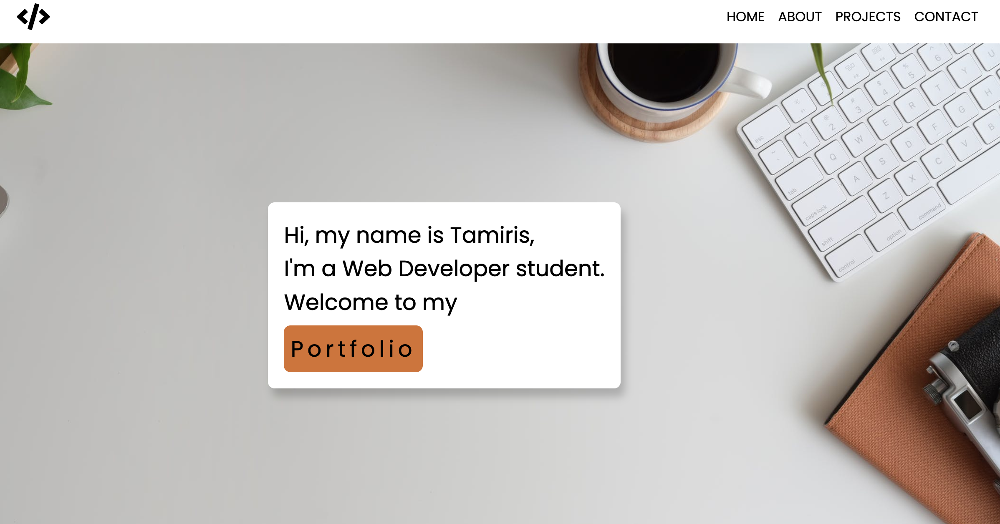

# My Portfolio

I created my Portfolio to help me improve my coding skills by building realistic projects. 

## Table of contents

- [Overview](#overview)
  - [Screenshot](#screenshot)
  - [Links](#links)
- [My process](#my-process)
  - [Built with](#built-with)
  - [What I learned](#what-i-learned)
- [Author](#author)


## Overview

Users should be able to:

- View the optimal layout for each page depending on their device's screen size
- See hover states for all interactive elements on the page

### Screenshot




### Links

- Live Site URL: [site URL here](https://tamiriscss.github.io/portfolio/)

## My process

### Built with

- Semantic HTML5 markup
- CSS custom properties
- SASS
- Flexbox
- Mobile-friendly
- JavaScript


### What I learned

```js
hamburger.addEventListener("click", () => {
    navLinks.classList.toggle("open");

    links.forEach(link => {
        link.classList.toggle("fade");
    });
});

links.forEach(link => {
    link.addEventListener('click', () => {
        hamburger.click();
    });
});
```


## Author

- linkedin - [Tamiris Cristine](https://www.linkedin.com/in/tamiris-cristine/)

